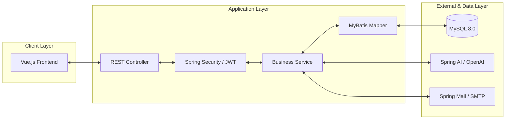
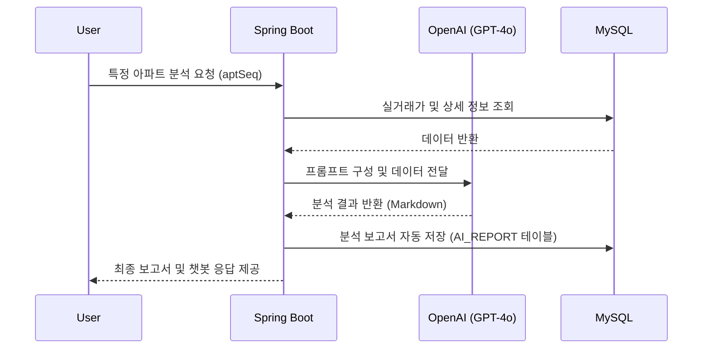

# 🏡 ijip-naejip (이제집) - Backend 🖥️

본 저장소는 사용자의 라이프스타일에 맞춘 부동산 매물 추천 및 AI 분석 서비스를 제공하는 **ijip-naejip** 프로젝트의 백엔드 소스코드입니다.

## 🚀 개요
- **프로젝트 명칭**: ijip-naejip (이제집)
- **주요 목적**: 실시간 거래 데이터 기반 아파트 검색 및 AI를 활용한 맞춤형 부동산 분석 보고서 제공
- **개발 환경**: Java 17, Spring Boot 3.5.8

---

## 🛠️ Tech Stack

### Framework & Database
- **Java 17** / **Spring Boot 3.5.8**
- **MyBatis** (Persistence Framework)
- **MySQL 8.0**
- **HikariCP** (Connection Pool)

### AI & API Integration
- **Spring AI**: OpenAI GPT-4o 연동 (부동산 데이터 분석 및 보고서 생성)
- **Kakao/Google OAuth2**: 소셜 로그인 지원
- **Gmail SMTP**: 회원가입 이메일 인증 및 비밀번호 재설정 기능

### Security & Utils
- **Spring Security** & **JWT** (JSON Web Token)
- **spring-dotenv**: `.env` 파일을 통한 환경 변수 관리 및 보안 강화
- **Lombok**: 보일러플레이트 코드 최적화
- **Swagger (OpenAPI 3.0)**: API 문서화 및 테스트

---

## ✨ 핵심 기능 (Key Features)

### 1. 🤖 AI 부동산 보고서 자동 생성
- AI 챗봇과의 상담 내용을 바탕으로 부동산 분석 보고서를 **마크다운 형식으로 자동 생성 및 저장**합니다.
- 사용자별 맞춤형 분석 결과 제공 및 영구 보관 기능을 지원합니다.

### 2. 🗺️ 지도 기반 매물 검색
- 사용자가 보고 있는 지도 영역(좌표 범위) 내의 아파트 실거래가 데이터를 실시간으로 조회합니다.
- 동별, 평형별, 금액대별 다양한 **필터링 기능**을 제공합니다.

### 3. 👤 사용자 인증 및 관리
- **JWT 기반의 안전한 인증** 체계를 구축했습니다.
- 회원가입 시 이메일 인증, 비밀번호 찾기(SMTP), 소셜 로그인(OAuth2)을 지원합니다.

### 4. ❤️ 관심 매물 및 통계
- 즐겨찾는 단지 등록 및 관리 기능을 제공합니다.
- 지역별 실거래가 통계 및 추이 분석 데이터를 제공합니다.

---

## 🏗️ System Architecture

---

## 🔄 AI 분석 및 보고서 생성 흐름 (AI Report Workflow)

---

## ✨ 핵심 기능 상세 (Key Features)

### 1. 🤖 AI 기반 맞춤형 부동산 비서
- **Spring AI Integration**: 단순 챗봇을 넘어 실제 매물 데이터를 기반으로 한 정밀 분석을 수행합니다.
- **자동 문서화**: 상담 이력을 마크다운 형식의 보고서로 즉시 변환하여 영구적으로 보관할 수 있습니다.

### 2. 🔐 보안 및 인증 아키텍처
- **JWT (Stateless)**: 서버 부하를 최소화하면서 안전한 사용자 인증을 제공합니다.
- **OAuth2 Social Login**: 카카오 및 구글 계정을 통한 간편 로그인 기능을 지원합니다.

### 3. 🗺️ 데이터 집계 및 검색 최적화
- **MyBatis Dynamic SQL**: 복잡한 필터링 조건을 효율적으로 처리하여 대용량 매물 데이터를 빠르게 검색합니다.
- **Region Hierarchy**: 법정동 코드를 활용한 시도-구군-동 단위의 계층형 지역 검색을 지원합니다.

---

## 📄 API Reference
서버 구동 후 다음 주소에서 상세한 API 명세를 확인할 수 있습니다.
- **Swagger UI**: `http://localhost:8080/swagger`
- **상세 문서**: `backend/APIs/` 폴더 내 마크다운 파일 참조

---

## 📁 프로젝트 구조
- `com.ssafy.home.ai`: AI 분석 및 보고서 모듈
- `com.ssafy.home.controller`: 각 기능별 API 컨트롤러
- `com.ssafy.home.dto`: 데이터 전송 객체
- `com.ssafy.home.mapper`: MyBatis 매퍼 인터페이스 및 XML
- `com.ssafy.home.service`: 비즈니스 로직 구현부
