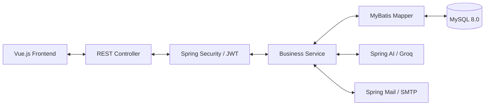

# 이집내집 (ijip-naejip) — Backend

실거래가 약 395만 건 위에서 AI 채팅·지도 검색·분석 리포트를 제공하는 부동산 서비스의 백엔드입니다.

- **환경**: Java 17 · Spring Boot 3.5.8
- **전체 서비스 문서**: 상위 [../README.md](../README.md) · [아키텍처](../docs/ARCHITECTURE.md) · [기술 회고록](../docs/TECHNICAL_REPORT.md)

## 이 백엔드의 두 가지 핵심

### 1. AI가 SQL을 쓰고 도구 하나로 실행하는 Tool Calling 구조

"마포구 30평대 5억 이하 거래 있어?"처럼 물으면, AI가 SQL SELECT 문을 작성하고 DB 조회 도구(`executeDatabaseQuery`)로 실행해 집계 결과를 자연어로 답합니다. 벡터 검색(RAG)으로는 "평균가", "최고가" 같은 집계 질문에 답할 수 없어 이 구조를 택했습니다. 대신 실행 창구를 도구 1개로 좁히고 SELECT만 허용합니다.

```
사용자 질문
  ▼
[전처리] RegionValidator — 지역명("마포")을 dongcodes 테이블과 대조해 법정동 코드 확정
  ▼
Spring AI ChatClient (Groq) — 도구 1개 등록, AI가 SQL을 작성해 호출
  └─ executeDatabaseQuery : SqlQueryValidator(SELECT만) 통과 후 실행
  ▼
수집 데이터로 자연어 응답 생성 (해요체 페르소나)
  ▼
ai_reports 테이블에 리포트 자동 저장 (비동기, 실패해도 응답 무관)
```

핵심 설계: **LLM에게 DB 지식을 기대하지 않습니다.** 지역명처럼 DB와 대조 가능한 값은 LLM 밖에서 결정론적으로 검증(`RegionValidator`)하고, 검증된 값만 AI 컨텍스트에 넣습니다.

### 2. 클라우드 이전 후 무너진 성능을 계층별로 측정·복구

Oracle Cloud 이전 직후 상세 조회가 최대 90초까지 걸렸습니다. 측정 도구(MyBatis 쿼리 인터셉터, HandlerInterceptor)를 직접 구현해 배포하고 4계층에 걸친 원인을 격리했습니다.

| 계층 | 원인 | 조치 |
|---|---|---|
| DB 설정 | InnoDB 버퍼 풀 기본값 128MB | 1GB 온라인 확장 |
| DB 스키마 | 좌표·복합 인덱스 부재 → 3.27M행 풀스캔 | 인덱스 4개 추가 |
| 응답 | JSON 미압축 | gzip (85% 감소) |
| 인프라 | 블록 볼륨 I/O가 NVMe 대비 47배 느림 | (원인 규명) |

**결과**: 평형 지정 상세 API `~5초 → ~23ms`, 지도 마커 API `~540ms → ~140ms`. 상세는 [성능 개선 리포트](../docs/PERFORMANCE_REPORT_완료.md).

## 기술 스택

| 분류 | 기술 |
|---|---|
| Framework | Java 17 · Spring Boot 3.5.8 |
| Persistence | MyBatis (어노테이션 + XML 하이브리드) · MySQL 8.0 · HikariCP |
| AI | Spring AI (Tool Calling) · Groq `openai/gpt-oss-120b` (OpenAI 호환 엔드포인트) |
| Auth | Spring Security · JWT (Stateless) · Kakao/Google OAuth2 · Gmail SMTP |
| Docs | Swagger (OpenAPI 3.0) · spring-dotenv |

> **LLM 제공자 이력**: OpenAI(SSAFY 무료 토큰, gpt-4.1 계열) → 로컬 Ollama(gemma3, 당일 포기) → Groq(llama-4-scout → `openai/gpt-oss-120b`). 어느 교체에서도 Java 코드는 바꾸지 않았고, 의존성과 설정만 바꿨습니다. 배경은 [트러블슈팅 #8](../docs/TROUBLESHOOTING.md#8).

## 핵심 기능

- **AI 부동산 채팅/리포트** — Tool Calling 기반 분석, 상담 내용을 마크다운 리포트로 자동 저장
- **지도 기반 매물 검색** — 줌 레벨에 따라 집계 단위를 5단계(APT_DONG→APT→DONG→GUGUN→SIDO)로 전환. 전국 데이터를 마커 폭발 없이 처리
- **인증** — JWT Stateless + 이메일 인증(SMTP) + 소셜 로그인(OAuth2), Kakao 이메일 미제공 시 socialId 폴백
- **관심 매물·통계** — 즐겨찾기, 지역별 실거래가 통계

## 아키텍처



- 계층: `Controller → Service(인터페이스 의존) → MyBatis Mapper`, DTO는 record 사용
- 읽기 성능: `pyung`은 DB Generated Column, 평형/동별 통계는 사전 집계 테이블(`apt_pyung_stats` 등)

## API 문서

모든 API는 `/api/v1` 하위에서 동작합니다.

- **Swagger UI**: `http://localhost:8080/api/v1/swagger`
- **API Docs (JSON)**: `http://localhost:8080/api/v1/api-docs`
- **상세 명세**: [회원 관리](docs/api/specs/User_API_회원_관리.md) · [관심 매물](docs/api/specs/Favorites_API_관심_매물.md) · [아파트 정보](docs/api/specs/Apartment_API_아파트_정보.md) · [지역 검색](docs/api/specs/Area_API_지역_검색.md) · [지역 코드](docs/api/specs/Region_Code_API_지역_코드.md)
- **AI 엔진**: [AI 프롬프트 전략](docs/ai/PROMPTS_GUIDE.md) · [보고서 자동 저장 로직](docs/ai/REPORT_FEATURE.md)

## 프로젝트 구조

```
com.ssafy.home
├── ai/            # AI 도메인 — Tool Calling, 지역 검증, SQL 검증, 프롬프트 관리
├── controller/    # REST 컨트롤러 (9개, 약 30개 엔드포인트)
├── service/       # 비즈니스 로직 (3-layer + 인터페이스)
├── mapper/        # MyBatis 매퍼 인터페이스 + XML
├── dto/           # 데이터 전송 객체 (record)
└── oauth/         # OAuth2 핸들러
```
